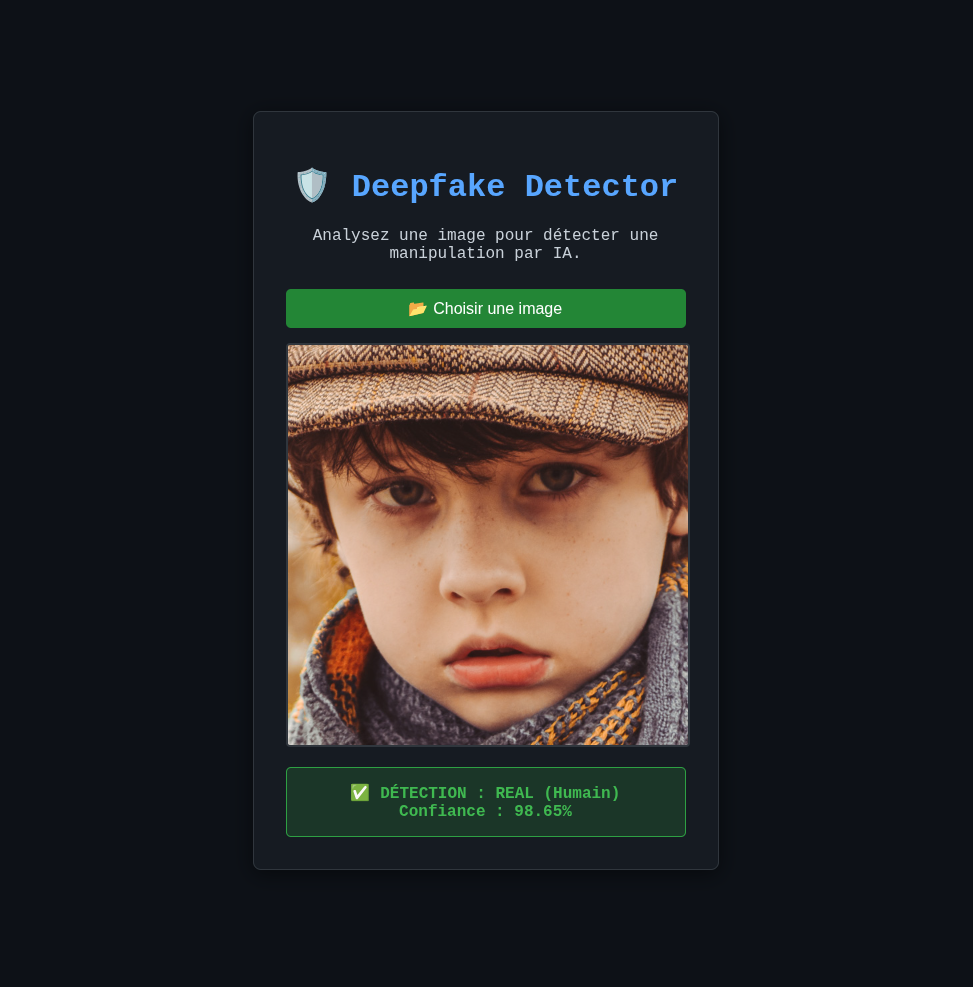

# 🛡️ **Medum Lion - Deepfake Detector**

> Une application full-stack de détection de deepfakes par intelligence artificielle


---


## 📋 **Table des matières**

1. [À propos](#à-propos)
2. [Caractéristiques](#caractéristiques)
3. [Architecture](#architecture)
4. [Prérequis](#prérequis)
5. [Installation](#installation)
6. [Utilisation](#utilisation)
7. [Entraînement du modèle](#entraînement-du-modèle)
8. [Structure du projet](#structure-du-projet)
9. [API Documentation](#api-documentation)
10. [Dépannage](#dépannage)

---

## 📖 **À propos**

**Medum Lion** est une application de détection de deepfakes basée sur le deep learning. Elle combine un **backend PyTorch** pour la classification et un **frontend web** intuitif pour permettre aux utilisateurs de vérifier l'authenticité d'images.

L'application utilise un modèle CNN (Convolutional Neural Network) entraîné sur des images réelles et générées par IA, capable de distinguer les deepfakes avec une précision élevée.



---

## ✨ **Caractéristiques**

- ✅ **Détection précise de deepfakes** : classification binaire (REAL / FAKE) avec score de confiance
- 🎨 **Interface web moderne** : design cyberpunk sombre et ergonomique
- 🚀 **API REST haute performance** : FastAPI avec CORS, prête pour la production
- 📊 **Entraînement flexible** : data augmentation, support CPU et GPU
- 🔄 **Pipeline complet** : téléchargement, traitement, prédiction en temps réel
- 💾 **Modèles persistants** : sauvegarde/chargement des meilleurs poids

---

## ️ **Architecture**

```
┌──────────────────────────────────────────────────────┐
│                  Frontend Web (HTML/JS)              │
│          index.html - Cyberpunk UI Design           │
└──────────────────┬───────────────────────────────────┘
                   │ POST /predict/
                   ↓
┌──────────────────────────────────────────────────────┐
│          Backend API (FastAPI + PyTorch)             │
│           main.py - Server & Inference               │
└──────────────────┬───────────────────────────────────┘
                   │
                   ↓
┌──────────────────────────────────────────────────────┐
│         ML Model (SimpleCNN - Torch)                 │
│    best_medumlion_model.pth - Pre-trained weights   │
└──────────────────────────────────────────────────────┘
```

### **Pipeline de classification**

```
Image Input (JPG/PNG)
     ↓
Resize 128×128
     ↓
Convert to Tensor + Normalize
     ↓
Pass through SimpleCNN
     ↓
Softmax Classification
     ↓
Output: {FAKE | REAL} + Confidence %
```

---

## 📦 **Prérequis**

- **Python** : 3.11 ou supérieur
- **pip** : gestionnaire de paquets Python
- **Espace disque** : ~1.5 GB (modèle + dépendances)
- **RAM** : 4 GB minimum (8 GB recommandé)
- **Processeur** : CPU ou GPU NVIDIA CUDA compatible

---

## 🚀 **Installation**

### **1. Cloner le repository**

```bash
git clone https://github.com/Batohack/Medum_Lion.git
cd Medum_Lion
```

### **2. Créer un environnement virtuel**

```bash
python3.11 -m venv medumlion
source medumlion/bin/activate  # Sur Windows: medumlion\Scripts\activate
```

### **3. Installer les dépendances**

```bash
pip install --no-cache-dir -r requirements.txt
```

**⚠️ Note sur l'espace disque** : 
Si vous rencontrez l'erreur `OSError: [Errno 122] Débordement du quota d'espace disque`, utilisez :

```bash
TMPDIR=/tmp python -m pip install --no-cache-dir -r requirements.txt
```

Ou installez la version **CPU-only** (plus légère) :

```bash
pip install --no-cache-dir torch torchvision torchaudio --index-url https://download.pytorch.org/whl/cpu
```

---

## 🎨 **Design & Animation**

### **Effet Matrix Cyberpunk**

L'interface web intègre une animation **Matrix en arrière-plan** : des caractères verts (incluant des kanji japonais) tombent du haut vers le bas en continu, créant une ambiance immersive de sécurité informatique.

**Caractéristiques de l'animation** :
- 🌿 **Caractères Matrix** : chiffres binaires (0/1) et kanji aléatoires
- 💚 **Couleur verte classique** : `#00ff00` pour l'authenticité
- ✨ **Trail effect** : halo de traînée semi-transparent
- 🎬 **Frame-based** : utilise `requestAnimationFrame` pour 60 FPS smooth
- 📱 **Responsive** : s'adapte automatiquement à la taille de l'écran
- 🎯 **Layering** : le conteneur principal apparaît au-dessus avec effet de verre dépoli (`backdrop-filter: blur(10px)`)

**Technologies** :
- HTML5 Canvas pour le rendu graphique
- JavaScript vanilla (pas de dépendances externes)
- CSS animations pour les éléments d'interface

---

## 💻 **Utilisation**

### **Option 1 : Interface Web (Recommandé)**

#### **1. Démarrer le serveur API**

```bash
python main.py
```

Vous verrez :
```
INFO:     Uvicorn running on http://127.0.0.1:8000
```

#### **2. Ouvrir l'application web**

Ouvrez votre navigateur à l'adresse :
```
http://127.0.0.1:8000
```

Ou ouvrez directement `index.html` (sans serveur) :
```bash
# Ne fonctionne pas sans CORS, privilégié du navigateur requiert le serveur
open index.html  # macOS
xdg-open index.html  # Linux
start index.html  # Windows
```

#### **3. Utiliser l'app**

1. Cliquez sur **"📂 Choisir une image"**
2. Sélectionnez une image (JPG, PNG, etc.)
3. L'image s'affiche et l'analyse commence
4. Résultat : 
   - 🟢 **REAL (Humain)** : confiance en %
   - 🔴 **FAKE (IA)** : confiance en %

### **Option 2 : API REST directement**

```bash
# Tester l'API
curl -X POST "http://127.0.0.1:8000/predict/" \
  -F "file=@/chemin/vers/image.jpg"
```

**Réponse JSON** :
```json
{
  "filename": "image.jpg",
  "prediction": "REAL",
  "confidence": "98.65%",
  "scores": {
    "fake_probability": 0.0135,
    "real_probability": 0.9865
  }
}
```

---

## 🤖 **Entraînement du modèle**

### **Préparer le dataset**

Organisez vos images dans cette structure :

```
~/Téléchargements/dataset/
├── fake/
│   ├── image1.jpg
│   ├── image2.jpg
│   └── ...
└── real/
    ├── image1.jpg
    ├── image2.jpg
    └── ...
```

### **Lancer l'entraînement**

```bash
python train_model.py
```

**Paramètres** (modifiables dans le script) :
- `EPOCHS` : nombre de cycles d'entraînement (défaut: 25)
- `BATCH_SIZE` : images par lot (défaut: 32)
- `IMG_SIZE` : résolution cible (défaut: 128×128)
- `DATA_DIR` : chemin du dataset

**Data Augmentation activée** :
- Retournement horizontal aléatoire (50%)
- Rotation légère (±15°)
- Variation de luminosité et contraste

Le meilleur modèle est sauvegardé dans `best_medumlion_model.pth`.

### **Vérifier les données**

```bash
python check_data.py
```

---

## 📁 **Structure du projet**

```
Medum_Lion/
├── 📄 main.py                    # Server API FastAPI + inference
├── 🤖 train_model.py             # Script d'entraînement du CNN
├── 📊 check_data.py              # Vérification du dataset
├── 🌐 index.html                 # Frontend web (interface utilisateur)
├── 💾 best_medumlion_model.pth   # Poids du modèle pré-entraîné
├── 💾 deepfake_model.pth         # Backup du modèle
├── 📋 requirements.txt           # Dépendances Python
├── 🖼️ test_image_resultat.png    # Résultat d'exemple
├── .git/                         # Historique Git
├── .gitignore                    # Fichiers ignorés
└── medumlion/                    # Environnement virtuel
```

---

## 📚 **API Documentation**

### **Route : `POST /predict/`**

Effectue une prédiction sur une image uploadée.

**Requête** :
```
POST /predict/ HTTP/1.1
Content-Type: multipart/form-data

file: <binary_image_data>
```

**Réponse (200 OK)** :
```json
{
  "filename": "test.jpg",
  "prediction": "REAL",
  "confidence": "98.65%",
  "scores": {
    "fake_probability": 0.0135,
    "real_probability": 0.9865
  }
}
```

### **Route : `GET /`**

Retourne un message de bienvenue.

**Réponse** :
```json
{
  "message": "Bienvenue sur l'API de détection de Deepfake. Allez sur /docs pour tester."
}
```

### **Interactive API Docs**

Accédez à la documentation Swagger :
```
http://127.0.0.1:8000/docs
```

Ou ReDoc :
```
http://127.0.0.1:8000/redoc
```

---

## 🔧 **Architecture du modèle**

Le modèle **SimpleCNN** utilisé :

```
Input (3, 128, 128)
    ↓
Conv2d(3→32) + ReLU + MaxPool2d → (32, 64, 64)
    ↓
Conv2d(32→64) + ReLU + MaxPool2d → (64, 32, 32)
    ↓
Conv2d(64→128) + ReLU + MaxPool2d → (128, 16, 16)
    ↓
Flatten → (128 × 16 × 16 = 32768)
    ↓
Linear(32768 → 512) + ReLU
    ↓
Linear(512 → 2)
    ↓
Softmax Classification
    ↓
Output: [P(FAKE), P(REAL)]
```

---

## 🐛 **Dépannage**

### **1. Erreur : `OSError: [Errno 122] Débordement du quota d'espace disque`**

**Cause** : Espace disque insuffisant pour télécharger les dépendances PyTorch.

**Solution** :
```bash
# Vider les caches
rm -rf ~/.cache/pip
python -m pip cache purge

# Installer sans cache
pip install --no-cache-dir -r requirements.txt

# Ou forcer un TMPDIR avec plus d'espace
TMPDIR=/tmp pip install --no-cache-dir -r requirements.txt
```

### **2. Erreur : `Module 'torch' not found`**

**Solution** :
```bash
# Vérifier l'environnement virtuel
source medumlion/bin/activate

# Réinstaller PyTorch
pip install torch torchvision torchaudio --index-url https://download.pytorch.org/whl/cpu
```

### **3. Erreur : `Could not load model weights`**

**Cause** : Fichier `best_medumlion_model.pth` manquant ou corrompu.

**Solution** :
```bash
# Réentraîner le modèle
python train_model.py

# Ou télécharger depuis le repo (si disponible)
```

### **4. Serveur ne démarre pas / Port 8000 déjà utilisé**

**Solution** :
```bash
# Tuer le processus occupant le port
lsof -i :8000 | grep LISTEN | awk '{print $2}' | xargs kill -9

# Ou utiliser un autre port
python -c "import main; main.app.run(host='127.0.0.1', port=8001)"
```

### **5. CORS error dans le navigateur**

**Cause** : Serveur n'accepte pas les requêtes du frontend.

**Solution** : Assurez-vous que `main.py` a le middleware CORS activé :
```python
app.add_middleware(
    CORSMiddleware,
    allow_origins=["*"],  # Production : spécifiez l'URL exacte
    allow_credentials=True,
    allow_methods=["*"],
    allow_headers=["*"],
)
```

---

## 📊 **Performance**

| Métrique | Valeur |
|----------|--------|
| **Temps d'inférence** | ~200 ms (CPU) |
| **Taille du modèle** | ~10 MB |
| **Résolution input** | 128×128 px |
| **Classes** | 2 (REAL / FAKE) |
| **Framework** | PyTorch 2.9 |

---

## 🔐 **Sécurité**

- ⚠️ **CORS ouvert** (`allow_origins=["*"]`) : À restreindre en production
- ⚠️ **Pas d'authentification** : Ajouter JWT/OAuth pour production
- ⚠️ **Pas de validation de taille d'image** : À implémenter pour éviter les DoS
- ✅ **Pas de stockage des images** : Traitées en mémoire uniquement

### **Recommandations Production**

```python
# À implémenter
origins = [
    "https://monsite.com",
    "https://app.monsite.com",
]

# Ajouter authentification
from fastapi_jwt_auth import AuthJWT

@app.post("/predict/")
def predict(file: UploadFile, Authorize: AuthJWT = Depends()):
    Authorize.jwt_required()
    # ... reste du code
```

---

## 📈 **Améliorations futures**

- [ ] Support du batch processing (plusieurs images)
- [ ] Visualisation des activations (heatmaps)
- [ ] Fine-tuning sur des modèles pré-entraînés (ResNet, EfficientNet)
- [ ] Dashboard statistiques
- [ ] Historique des prédictions
- [ ] Support des vidéos (détection frame-by-frame)
- [ ] Déploiement Docker
- [ ] CI/CD avec GitHub Actions

---

## 📝 **Licence**

Ce projet est sous licence **MIT**. Voir le fichier `LICENSE` pour plus de détails.

---

## 🤝 **Contribuer**

Les contributions sont bienvenues ! Pour contribuer :

1. Fork le repository
2. Créez une branche feature (`git checkout -b feature/NouvelleFeature`)
3. Commitez vos changements (`git commit -m 'Ajout de NouvelleFeature'`)
4. Poussez vers la branche (`git push origin feature/NouvelleFeature`)
5. Ouvrez une Pull Request

---

## 👨‍💻 **Auteur**

**Batohack** - [GitHub](https://github.com/Batohack)

---

## 💬 **Support**

- **Issues** : [GitHub Issues](https://github.com/Batohack/Medum_Lion/issues)
- **Discussions** : Questions de développement bienvenues

---

## 🙏 **Remerciements**

- PyTorch & TorchVision pour le framework
- FastAPI pour l'API ultra-rapide
- La communauté open-source

---

**Dernière mise à jour** : 10 décembre 2025

**Version** : 1.0.0

---

Made with ❤️ by **Batohack**
